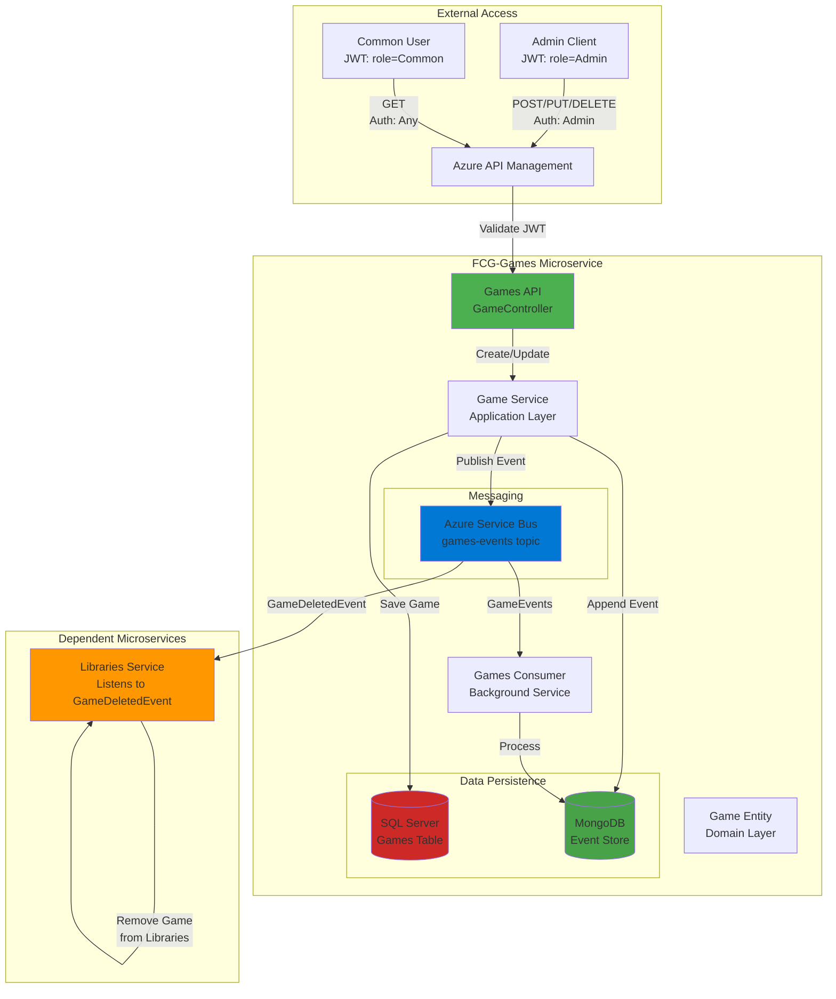
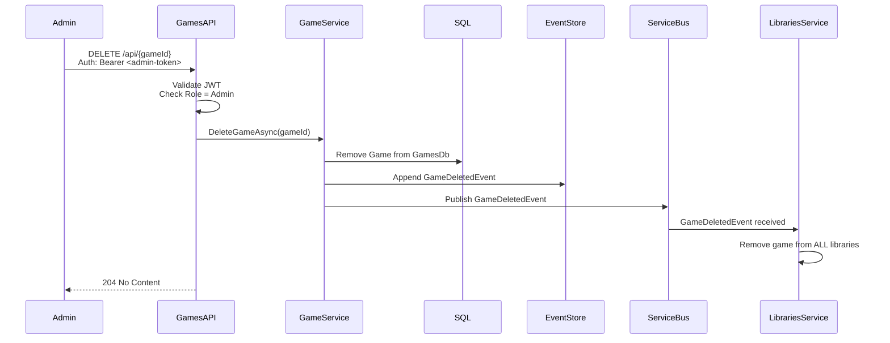

# 🎮 FCG-Games - Game Catalog Service

> **Microsserviço de Catálogo de Jogos** - Gerenciamento de games com Event Sourcing e sincronização distribuída

[](https://dotnet.microsoft.com/)
[](https://blog.cleancoder.com/uncle-bob/2012/08/13/the-clean-architecture.html)
[](https://martinfowler.com/eaaDev/EventSourcing.html)
[](https://martinfowler.com/bliki/DomainDrivenDesign.html)
[](https://microservices.io/)

## 🎯 O que é este projeto?

**FCG-Games** é o **microsserviço de catálogo de jogos** responsável por gerenciar todo o ciclo de vida de games na plataforma FCG. Implementa **Event Sourcing completo**, **comunicação assíncrona** via Service Bus, e mantém **sincronização automática** com o serviço de bibliotecas através de eventos de domínio.

### Responsabilidades Principais
- ✅ CRUD completo de jogos (Create, Read, Update, Delete)
- ✅ Event Sourcing: histórico imutável de todas as alterações em jogos
- ✅ Publicação de eventos de domínio (GameCreated, GameUpdated, GameDeleted)
- ✅ Sincronização distribuída: quando game é deletado, remove-se automaticamente de todas as bibliotecas
- ✅ Autorização baseada em roles (Admin-only para criação/edição/deleção)

---

## 🚀 Tecnologias e Padrões Aplicados

### Stack Técnico Completo
| Tecnologia | Propósito | Conceito Aplicado |
|------------|-----------|-------------------|
| **ASP.NET Core 8** | Web API Framework | RESTful API, Middleware Pipeline |
| **Entity Framework Core 8** | ORM | Code-First, Migrations, Change Tracking |
| **SQL Server** | Banco Relacional | Persistência do estado atual dos jogos |
| **MongoDB (Cosmos DB)** | NoSQL Document Store | Event Store (eventos imutáveis) |
| **Azure Service Bus** | Message Broker | Topic-based Pub/Sub, Event Distribution |
| **AutoMapper** | Object Mapping | DTO ↔ Entity transformation |
| **FluentValidation** | Validação | Fluent API para regras de negócio |
| **Swagger/Swashbuckle** | API Documentation | OpenAPI 3.0 Specification |
| **Docker** | Containerização | Multi-stage builds, Alpine images |

### Padrões Arquiteturais Implementados

#### 🏗️ **Clean Architecture (Onion Architecture)**
```
┌─────────────────────────────────────┐
│    API Layer (GameController)       │  ← Apresentação
├─────────────────────────────────────┤
│  Application Layer (GameService)    │  ← Casos de Uso
├─────────────────────────────────────┤
│    Domain Layer (Game Entity)       │  ← Regras de Negócio
├─────────────────────────────────────┤
│ Infrastructure (EF, Service Bus)    │  ← Detalhes Técnicos
└─────────────────────────────────────┘
```
- **Separation of Concerns**: Cada camada tem responsabilidade única
- **Dependency Inversion**: Abstrações no Domain, implementações na Infrastructure
- **Testability**: Domain testável sem banco de dados ou message broker

#### 📊 **Domain-Driven Design (DDD)**
- **Entities**: Game como entidade com identidade única
- **Aggregates**: Game é aggregate root (controla seu ciclo de vida)
- **Domain Events**: GameCreatedEvent, GameUpdatedEvent, GameDeletedEvent
- **Repositories**: Abstração de persistência (IGameRepository)
- **Value Objects**: Possibilidade de Price, Rating como value objects

#### 🔄 **Event Sourcing**
- **Event Store**: MongoDB armazena TODOS os eventos de alteração de jogos
- **Immutable Events**: Histórico completo de criação, atualizações, deleções
- **Temporal Queries**: Reconstruir catálogo em qualquer ponto no tempo
- **Audit Trail**: Rastreabilidade total de quem/quando alterou jogos

#### 📨 **Event-Driven Architecture (EDA)**
- **Domain Events**: Fatos que aconteceram (GameDeleted)
- **Choreography**: Libraries Service reage a GameDeletedEvent autonomamente
- **Eventual Consistency**: Garantia de consistência eventual entre serviços
- **Dead Letter Queue**: Mensagens problemáticas isoladas automaticamente

#### 🔐 **Authorization Patterns**
- **Role-Based Access Control (RBAC)**: Admin vs Common users
- **Policy-Based Authorization**: [Authorize(Roles = "Admin")]
- **Defense in Depth**: APIM + Application-level authorization

---

## 📐 Estrutura do Projeto

```
FCG-Games/
├── FCG-Games.Api/              # Controllers, Middleware, Startup
│   ├── Controllers/
│   │   └── GameController.cs   # Endpoints REST
│   ├── Middleware/
│   │   └── ExceptionMiddleware.cs
│   └── Program.cs              # DI Container, Auth Config
│
├── FCG-Games.Application/      # Casos de Uso, DTOs
│   ├── DTOs/
│   │   ├── CreateGameRequest.dto.cs
│   │   └── UpdateGameRequest.dto.cs
│   ├── Services/
│   │   └── GameService.cs      # Lógica de aplicação
│   └── Validators/
│       └── CreateGameValidator.cs
│
├── FCG-Games.Domain/           # Entidades, Interfaces
│   ├── Entities/
│   │   └── Game.cs             # Aggregate Root
│   ├── Events/
│   │   ├── GameCreatedEvent.cs
│   │   ├── GameUpdatedEvent.cs
│   │   └── GameDeletedEvent.cs
│   └── Interfaces/
│       └── IGameRepository.cs
│
├── FCG-Games.Infrastructure/   # EF Core, Service Bus, MongoDB
│   ├── Data/
│   │   ├── AppDbContext.cs
│   │   └── Migrations/
│   ├── Repositories/
│   │   └── GameRepository.cs
│   ├── EventStore/
│   │   └── MongoEventStore.cs
│   └── Messaging/
│       └── ServiceBusPublisher.cs
│
└── FCG-Games.Consumer/         # Background Service
    └── Workers/
        └── GamesEventsConsumer.cs
```

---

## ⚙️ Configuração e Execução

### Pré-requisitos
- .NET 8 SDK
- SQL Server (local ou Azure)
- MongoDB (local, Docker ou Cosmos DB)
- Azure Service Bus namespace
- JWT Key (compartilhada com FCG-Users)

### Configuração (appsettings.json)

```json
{
  "ConnectionStrings": {
    "DefaultConnection": "Server=localhost;Database=GamesDb;Trusted_Connection=True;"
  },
  "ServiceBus": {
    "ConnectionString": "<service-bus-connection-string>",
    "Topics": {
      "Games": "games-events"
    },
    "Subscriptions": {
      "Games": "games-subscription"
    }
  },
  "MongoSettings": {
    "ConnectionString": "mongodb://localhost:27017",
    "Database": "EventStoreDb",
    "Collection": "Events"
  },
  "Jwt": {
    "Key": "9y4XJg0aTphzFJw3TvksRvqHXd+Q4VB8f7ZvU08N+9Q=",
    "Issuer": "FGC-Users",
    "Audience": "API"
  }
}
```

### Executar Migrations
```powershell
cd FCG-Games.Api
dotnet ef database update
```

### Executar API
```powershell
cd FCG-Games.Api
dotnet run
# API disponível em: https://localhost:7002
```

### Executar Consumer
```powershell
cd FCG-Games.Consumer
dotnet run
```

### Testar no Swagger
Navegue para: `https://localhost:7002/swagger`

---

## 🔐 Autorização e Endpoints

### Matriz de Autorização

| Método | Endpoint | Autorização | Descrição |
|--------|----------|-------------|-----------|
| GET | `/api` | [Authorize] | Listar todos os jogos (qualquer usuário autenticado) |
| GET | `/api/{id}` | [Authorize] | Obter jogo por ID (qualquer usuário autenticado) |
| POST | `/api` | [Authorize(Roles="Admin")] | Criar novo jogo (APENAS Admin) |
| PUT | `/api/{id}` | [Authorize(Roles="Admin")] | Atualizar jogo (APENAS Admin) |
| DELETE | `/api/{id}` | [Authorize(Roles="Admin")] | Deletar jogo (APENAS Admin) |

### Exemplo de Request (Criar Jogo)

**Obter token JWT** (via FCG-Users):
```bash
curl -X POST https://localhost:7001/api/auth \
  -H "Content-Type: application/json" \
  -d '{"email": "admin@fcg.com", "password": "Senha@123"}'
```

**Criar jogo** (com token Admin):
```bash
curl -X POST https://localhost:7002/api \
  -H "Authorization: Bearer <token>" \
  -H "Content-Type: application/json" \
  -d '{
    "name": "The Witcher 3",
    "developer": "CD Projekt Red",
    "price": 59.99,
    "releaseDate": "2015-05-19"
  }'
```

**Response**:
```json
{
  "id": "3fa85f64-5717-4562-b3fc-2c963f66afa6",
  "name": "The Witcher 3",
  "developer": "CD Projekt Red",
  "price": 59.99,
  "releaseDate": "2015-05-19T00:00:00Z",
  "createdAt": "2026-01-09T10:00:00Z"
}
```

---

## 🏛️ Arquitetura - Diagrama Mermaid



---

## 🔄 Fluxo de Eventos - Exemplo de Deleção

### Cenário: Admin deleta "The Witcher 3"



**Resultado**: Game deletado + Evento persistido + TODAS as bibliotecas atualizadas automaticamente!

---

## 🧪 Padrões de Código Demonstrados

### Repository Pattern
```csharp
public interface IGameRepository
{
    Task<Game> GetByIdAsync(Guid id);
    Task<IEnumerable<Game>> GetAllAsync();
    Task AddAsync(Game game);
    Task UpdateAsync(Game game);
    Task DeleteAsync(Guid id);
}

public class GameRepository : IGameRepository
{
    private readonly AppDbContext _context;
    
    public async Task<Game> GetByIdAsync(Guid id)
    {
        return await _context.Games
            .AsNoTracking()
            .FirstOrDefaultAsync(g => g.Id == id);
    }
}
```

### Event Publishing
```csharp
public async Task<Game> CreateGameAsync(CreateGameRequest request)
{
    var game = Game.Create(request.Name, request.Developer, request.Price);
    
    // 1. Persistir no SQL
    await _repository.AddAsync(game);
    
    // 2. Append no Event Store
    var @event = new GameCreatedEvent
    {
        GameId = game.Id,
        Name = game.Name,
        Developer = game.Developer,
        Price = game.Price,
        CreatedAt = DateTime.UtcNow
    };
    
    await _eventStore.AppendAsync(game.Id.ToString(), 0, @event);
    
    // 3. Publicar no Service Bus
    await _publisher.PublishAsync(@event);
    
    return game;
}
```

---

## 📊 Observabilidade

### Logs Estruturados com CorrelationId
```csharp
_logger.LogInformation(
    "Jogo criado | GameId: {GameId} | Name: {Name} | CorrelationId: {CorrelationId}",
    game.Id,
    game.Name,
    HttpContext.TraceIdentifier
);
```

### Métricas Importantes
- Número de jogos cadastrados
- Taxa de sucesso de publicação de eventos
- Latência de sincronização com Libraries
- Eventos no Dead Letter Queue

---

## 🎓 Conceitos Avançados Demonstrados

### **Distributed Transactions (Saga Pattern)**
Não usamos transações distribuídas (2PC). Em vez disso:
1. Persistimos localmente (SQL + Event Store)
2. Publicamos evento
3. Outros serviços compensam se necessário (eventual consistency)

### **Idempotency**
Event Store usa versioning para prevenir eventos duplicados:
```csharp
await _eventStore.AppendAsync(streamId, expectedVersion: 0, @event);
```

### **Choreography vs Orchestration**
Usamos **choreography**: cada serviço reage a eventos independentemente (sem orquestrador central).

### **Bounded Context Isolation**
Games não conhece detalhes de Libraries. Comunicação apenas via eventos de domínio.

---

## 📚 Referências Técnicas

- [Clean Architecture (Uncle Bob)](https://blog.cleancoder.com/uncle-bob/2012/08/13/the-clean-architecture.html)
- [Event Sourcing (Greg Young)](https://www.eventstore.com/blog/what-is-event-sourcing)
- [Microservices Patterns (Chris Richardson)](https://microservices.io/patterns/index.html)
- [DDD Reference (Eric Evans)](https://www.domainlanguage.com/ddd/reference/)
- [Saga Pattern (Microsoft)](https://docs.microsoft.com/azure/architecture/reference-architectures/saga/saga)  
- **Swagger** para documentação e testes de endpoints.  
- **GlobalExceptionMiddleware** para captura e padronização de erros.

---

## Competências demonstradas
- Microsserviços  
- Event Sourcing  
- Event-Driven Architecture (EDA)  
- Azure Service Bus  
- MongoDB (Event Store)  
- Entity Framework Core  
- .NET 8 / ASP.NET Core  
- Repository Pattern  
- Dependency Injection  
- Middleware personalizado  
- Idempotência  
- Docker  
- Swagger


## Objetivo
Este projeto foi desenvolvido como parte de um portfólio pessoal para demonstrar:
- Conhecimento em **arquitetura de microsserviços**.  
- Aplicação prática de **event sourcing** e **mensageria assíncrona**.  
- Uso de **padrões de projeto** e boas práticas de engenharia de software.  
